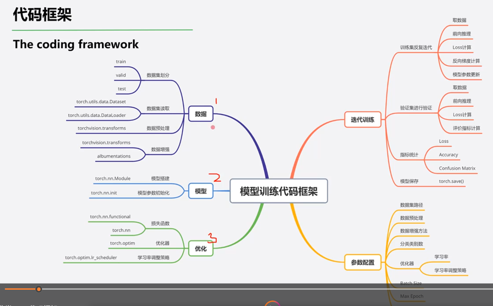

# 2026.2.22

## 损失函数

损失函数：衡量模型输出与真实标签的差异

代价函数：归结所有样本点求平均

目标函数：Cost+Regularization（正则化项控制过拟合）

### nn.CrossEntropyLoss

nn.LogSoftmax()与nn.NLLLoss()结合，进行交叉熵运算

主要参数：weight  ignore_index  reduction

### nn.NLLLoss

实现负对数似然函数中的负号功能

### nn.BCELoss

二分类交叉熵 输入值取值在[0,1]

### nn.BCEWithLogitsLoss

结合Sigmoid与二分类交叉熵  网络最后不加Sigmoid函数

### nn.L1Loss

MAE(平均绝对误差)

计算inputs与target之差的绝对值

### nn.MSELoss

MSE(平方误差)

计算inputs与target之差的平方

主要是用于回归任务

## 优化器（optimizer）

pytorch的优化器：管理并更新模型中可学习参数的值，使得模型输出更接近真实标签

### 学习率调整

梯度下降：wi+1 = wi - LR * g(wi)

学习率控制更新的步伐

class LRScheduler   主要属性：optimizer：关联的优化器 last_epoch：记录的epoch数

base_lrs:记录初始学习率  step()：更新下一个epoch的学习率   get_lr():计算下一个epoch的学习率

#### stepLR

stepLR 等间隔调整学习率  lr = lr * γ

#### MultiStepLR

按给定间隔调整学习率主要参数

milestones：设置调整时刻数       gamma：调整系数

# 2026.2.23

## 学习率

### ExponentialLR

功能：按指数衰减调整学习率

LR = LR * gamma ** epoch

gamma是指数的底

### CosineAnnealingLR

功能：余弦周期调整学习率

主要参数 T_max:下降周期   eta_min:学习率下限

### ReduceLRonPlateau

功能：监控指标，当指标不再变化则调整

### lambda自定义

## 可视化工具--TensorBoard

## Claude Code


# 2026.2.24

## 花朵分类

### 模型训练的代码框架



### 下载数据集

https://www.robots.ox.ac.uk/~vgg/data/flowers/102/

dataset images 和 image labels

### 划分花朵的数据集

```python
#划分花朵数据集
import os
import random
if __name__ == "__main__":
#step1根据图像路径得到所有图像的列表
    img_dir = r"D:\data\flowers_data\jpg"
    img_list = [os.path.join(img_dir, name) for name in
                os.listdir(img_dir)]
    random.seed(10086)
    random.shuffle(img_list)
```

**`if __name__ == "__main__":`** 这是 Python 的一个标准用法。它的意思是：“如果当前这个脚本是被直接运行的（而不是被其他 Python 脚本当作模块导入的），那么就执行下面的代码”。这通常用于程序的入口点。

**`#step1根据图像路径得到所有图像的列表`** 这是一行单行注释（以 `#` 开头）。它不会被程序执行，仅仅是写给程序员看的，用来标记和说明接下来的代码是在做“获取图像列表”的第一步工作。

**`img_dir = r"D:\data\flowers_data\jpg"`** 这一行定义了一个名为 `img_dir` 的变量，用来存储图片所在的文件夹路径。 *注意字符串前面的小写字母 `r`*：它代表“原始字符串（raw string）”。在 Windows 系统中，路径通常使用反斜杠 `\`，而反斜杠在 Python 中默认是转义字符（比如 `\n` 代表换行）。加上 `r` 之后，Python 就会把 `\` 当作普通的斜杠处理，防止路径解析出错。

**`img_list = [os.path.join(img_dir, name) for name in os.listdir(img_dir)]`** 这是一句非常 Pythonic 的“列表推导式”，它把几步操作浓缩在了一行：

1. `os.listdir(img_dir)`：读取 `img_dir` 文件夹里面的所有文件和子文件夹的**名称**（仅仅是名字，比如 `image1.jpg`）。
2. `for name in ...`：遍历这些名称。
3. `os.path.join(img_dir, name)`：将原本的文件夹路径和文件名智能拼接起来，变成完整的文件路径（比如 `D:\data\flowers_data\jpg\image1.jpg`）。
4. 最终，这行代码生成了一个包含所有图片**完整路径**的列表，并把它赋值给变量 `img_list`。

**`random.seed(10086)`** 这行代码用于设置随机数生成器的“种子（seed）”为 `10086`。 在编程中，所谓的“随机”其实是伪随机。如果你设置了一个固定的种子，那么无论你运行这段代码多少次，接下来的随机操作（比如打乱顺序）得出的结果都将是**一模一样**的。这在模型训练时非常关键，可以保证你的实验结果是可复现的。

**`random.shuffle(img_list)`** 这行代码调用 `random` 模块的 `shuffle` 方法，直接对 `img_list` 这个列表进行“洗牌”（就地打乱列表里元素的顺序）。因为上一行设定了固定的种子 `10086`，所以每次运行这行代码时，列表被打乱后的最终顺序都是一致的。

```python
#step2根据比例获得训练集和验证集的列表 8:2
    train_ratio = 0.8
    valid_ratio = 0.2
    num_img = len(img_list)
    num_train = int(num_img * train_ratio)
    num_valid = num_img - num_train
    train_list = img_list[: num_train]
    valid_list = img_list[num_train: ]
```

**`train_ratio = 0.8`** 定义一个名为 `train_ratio` 的变量，将训练集所占的比例设置为 0.8（即 80%）。

**`vaild_ratio = 0.2`** 定义一个名为 `vaild_ratio` 的变量，将验证集所占的比例设置为 0.2（即 20%）。*（温馨提示：这里的单词拼写稍微有一点笔误，正确的拼写通常是 `valid_ratio`，但不影响程序的正常运行，只要后面保持一致即可。）*

**`num_img = len(img_list)`** 调用 Python 内置的 `len()` 函数，计算 `img_list` 里面一共有多少张图片的路径。这个总数被赋值给变量 `num_img`。

**`num_train = int(num_img \* train_ratio)`** 这行代码计算训练集应该包含多少张图片：

1. 先将图片总数乘以 0.8（`num_img * train_ratio`）。
2. 因为乘法得到的结果可能是一个带有小数的浮点数（比如总数是 101，乘出来是 80.8），而图片的数量必须是整数。所以这里使用了 **`int()`** 函数来进行向下取整，确保得到的 `num_train` 是一个整数。

**`num_valid = num_img - num_train`** 这行代码计算验证集应该包含多少张图片。它非常聪明地使用了**总数减去训练集数量**的方式，而不是使用 `int(num_img * vaild_ratio)`。这样做可以完美避免因为前面取整而导致的四舍五入误差，确保（训练集图片数 + 验证集图片数）绝对等于总图片数，没有任何遗漏。

**`train_list = img_list[: num_train]`** 这里使用了 Python 中非常强大的**列表切片（Slicing）**功能。`[: num_train]` 的意思是：从列表的最开始（索引 0）一直截取到索引为 `num_train` 的位置（**不包含** `num_train` 本身）。截取出来的这一大段列表被保存为 `train_list`，也就是我们的训练集。

**`valid_list = img_list[num_train: ]`** 同样是列表切片。`[num_train: ]` 的意思是：从索引 `num_train` 的位置开始，一直截取到列表的最后。因为前一步的截取刚好在 `num_train` 之前停下，所以这一步完美地接上了剩下的所有图片路径。截取出来的这一段被保存为 `valid_list`，即验证集。

```python
#step3根据列表把图像移动到新的文件夹下

    target_dir = os.path.abspath(os.path.dirname(img_dir))

    copy_file(train_list,target_dir,"train")

    copy_file(valid_list,target_dir,"valid")

def copy_file(img_list, target_dir, setname='train'):

    img_dir = os.path.join(target_dir,setname)

    os.makedirs(img_dir, exist_ok = True)

    for p in img_list:

        shutil.copy(p,img_dir)

    print(f"{setname} dataset: copy {len(img_list)} images to {img_dir}")
```

 核心功能函数 `copy_file`

这段代码定义了一个专门用来复制文件的“小工具”。

- **`def copy_file(img_list, target_dir, setname='train'):`** 定义了一个名为 `copy_file` 的函数。它接收三个参数：
  1. `img_list`：要处理的图片路径列表（比如前面生成的 `train_list` 或 `valid_list`）。
  2. `target_dir`：目标存放的总目录。
  3. `setname='train'`：子文件夹的名字。这里给了一个默认值 `'train'`，如果你调用函数时不写第三个参数，它就默认是 'train'。
- **`img_dir = os.path.join(target_dir,setname)`** 将目标总目录（`target_dir`）和子文件夹名（`setname`）拼接起来，得到最终存放图片的具体文件夹路径。比如拼接成 `D:\data\flowers_data\train`。
- **`os.makedirs(img_dir, exist_ok = True)`** 这是非常实用的一行代码！它的作用是**创建这个文件夹**。 `exist_ok = True` 是一个“护身符”：如果这个文件夹还不存在，它就会新建一个；如果这个文件夹**已经存在了**，程序也不会报错崩溃，而是静悄悄地继续往下执行。
- **`for p in img_list:`** 使用 `for` 循环，挨个遍历列表 `img_list` 里的每一个图片绝对路径，并把当前正在处理的路径暂存到变量 `p` 中。
- **`shutil.copy(p,img_dir)`** 调用 `shutil` 模块的 `copy` 方法，把路径为 `p` 的这张图片，**复制**一份到我们刚刚创建的 `img_dir` 文件夹里。
- **`print(f"{setname} dataset: copy {len(img_list)} images to {img_dir}")`** 任务完成后，打印一条提示信息报告战况。这里用了 Python 的 `f-string` 语法（字符串前面加 `f`），可以很方便地把变量的值塞进字符串里。比如打印出：“train dataset: copy 800 images to D:\data\flowers_data\train”。

# 2026.2.25

## 读取数据集（转换成Tensor）

```python
from torch.utils.data import Dataset
from typing import Any
from PIL import Image
import os
class FlowerDataset(Dataset):
    def __init__(self,img_dir,transform = None) -> None:
        super().__init__()
        self.img_dir = img_dir
        self.img_infos = [] #path,label ...
        self._get_img_info()
        self.transform = transform

    def __getitem__(self,index) -> Any:
        img_info:Dict = self.img_infos[index]
        img_path,label_id = img_info["path"],img_info["label"]
        #PIL优：适配torchvision.transform 劣：边缘端非py部署不支持PIL读取
        img = Image.open(img_path).convert("RGB")
        #opencv cv2
        #img = cv2.imread(img_path) #BGR
        #img = cv2.cvtColor(img,cv2.COLOR_BGR2RGB)
        if self.transform is not None:
            img = self.transform(img)

        return img,label_id
    
    def __len__(self):
        return len(self.img_infos)
    
    def _get_img_info(self):
        """ 根据图片文件夹路径获得所有图片的信息
        """
        label_file = os.path.join(os.path.dirname(self.img_dir),"imagelabels.mat")
        assert os.path.exists(label_file)
        #read .mat
        from scipy.io import loadmat
        #[1,8189] 0-1:label_id 1-2:label_id,...
        label_array = loadmat(label_file)["labels"]
        #min_id:1 max_id:102 1-102 pytorch:0-101
        label_array -= 1 #from 0

        #根据图像名得到对应的label_id
        for img_name in os.listdir(self.img_dir):
            path = os.path.join(self.img_dir,img_name)
            if not img_name[6:11].isdigit():
                continue
            img_id = int(img_name[6:11])
            col_id = img_id - 1
            cls_id = int(label_array[:,col_id])#from 0
            self.img_infos.append({"path":path,"label":cls_id})

if __name__  == "__main__":
    img_dir = r"D:\data\flowers_data\train"
    dataset = FlowerDataset(img_dir)
    img,label_id = dataset[0]
    data_size = len(dataset)

```

### 什么是 .mat 文件？有什么用？

- **它的真身：** `.mat` 是 **MATLAB** 软件专属的数据存储格式。就像 Excel 保存为 `.xlsx`，Word 保存为 `.docx` 一样，MATLAB 把它的矩阵、变量保存为 `.mat`。

- **为什么会出现在这里：** 这个数据集（看名字应该是著名的 Oxford 102 Flowers 数据集）的原始作者，当年习惯使用 MATLAB 来做科研。他们没有用我们常见的 `.txt` 或 `.csv` 来记录“哪张图片对应哪个花卉编号”，而是把这 8000 多张图片的标签，打包成了一个巨大的数组（矩阵），直接存成了 `imagelabels.mat`。

  **在这里的作用：** 它就是一个**“标签字典”**。里面存放着一个数组，数组的第 1 个位置记录着第 1 张图片的类别，第 2 个位置记录着第 2 张图片的类别，以此类推。我们需要用 Python 的 `scipy` 库把它“翻译”读取出来，赋给对应的图片

  ###  深度学习数据预处理与 PyTorch Dataset 核心问题答疑笔记

  ### 一、 Python 基础与语法机制

  **1. `img_list` 到底属于什么变量？**

  - **解答：** 它是一个**由字符串（String）组成的列表（List）**。可以把它想象成一个装满纸条的盒子，每张纸条上写着一张图片的“绝对路径”（如 `'D:\...\image_001.jpg'`）。后续的打乱（`shuffle`）和切片操作都是基于它是一个列表的特性。

  **2. 引入包时，`import xxx` 和 `from xxx import yyy` 有什么区别？为什么不全用 `import`？**

  - **解答：** 两者都会把库加载进内存，区别在于**调用时的写法**。
    - `import torch`：把整个工具箱搬过来，每次用里面的东西都要带上长长的前缀（如 `torch.utils.data.Dataset`），防重名但代码繁琐。
    - `from torch.utils.data import Dataset`：把特定的工具直接拿出来放在桌面上，调用时直接写 `Dataset()` 即可。代码极其清爽，在深度学习框架中非常常用。

  **3. Python 类里面，`def _func()` (单下划线) 和 `def __func()` (双下划线) 的区别？**

  - **解答：** * **单下划线 `_`（君子协定）：** 提示这是类的内部方法，不建议外部直接调用，但 Python 解释器**不会强制阻止**外部访问。
    - **双下划线 `__`（强制机制）：** 触发 Python 的“名称改编（Name Mangling）”机制，Python 会偷偷把这个方法改名（加上类名前缀），主要为了防止子类意外覆盖父类方法。外部直接调用会报错。

  **4. 为什么 `img, label_id = dataset[0]` 可以直接返回并接收两个变量？**

  - **解答：** 这是 Python 的**元组解包（Tuple Unpacking）**机制。当函数 `return a, b` 时，底层会自动打包成一个元组 `(a, b)`。接收时如果等号左边写了两个变量名，Python 会自动把元组拆开并一一对应赋值。

  ------

  ### 二、 PyTorch 数据集设计哲学与机制

  **1. 既然已经用代码把图片按 8:2 分进了 train 和 valid 文件夹，为什么还要写一大串 `FlowerDataset` 类？**

  - **解答：** 神经网络（主厨）只认识“纯数字矩阵（Tensor）”，不认识物理文件夹和 `.jpg` 文件。`FlowerDataset` 相当于一个**备菜员**，它的任务是：去硬盘找到图片 -> 读取图片 -> 转换成数字矩阵 -> 查出对应的数字标签 -> 把矩阵和标签打包递给模型。它是连接“物理硬盘”和“数学模型”的桥梁。

  **2. 深度学习图像分类的总体步骤是什么？**

  - **解答：** 主要分为四大核心阶段：
    1. **数据准备：** 收集图片 -> 划分物理文件夹 -> 写 Dataset 类（备菜员） -> 写 DataLoader（传菜员）。
    2. **模型构建：** 搭建或加载预训练好的神经网络（如 ResNet）。
    3. **训练与验证：** 前向传播猜结果 -> 计算损失（Loss） -> 反向传播算梯度 -> 优化器（Optimizer）更新参数。随后在验证集上评估准确率。
    4. **保存模型：** 保存表现最好的参数权重 `.pth` 文件。

  **3. 代码里经常被调用的 `dataset[0]`，为什么会自动执行 `__getitem__()` 方法？**

  - **解答：** `__getitem__` 是 Python 的**魔法方法（Magic Method）**。中括号 `[]` 只是一个语法糖，当 Python 解释器看到对对象使用中括号取值时，就会在底层自动触发并调用该类的 `__getitem__` 方法，并将中括号里的数字作为 `index` 参数传进去。

  **4. 自定义解析方法 `def _get_img_info(self)` 是在什么时候被执行的？为什么要这么设计？**

  - **解答：** 它是在**实例化对象的那一瞬间（即执行 `dataset = FlowerDataset(...)` 时）**，被 `__init__` 初始化方法自动调用执行的，且**只执行一次**。
    - **设计目的：** 相当于“开店前的备菜”。必须在训练开始前，一次性把所有图片的路径和标签对应好存入内存列表。如果放在 `__getitem__` 里，模型每次看一张图都要重新遍历一遍硬盘，训练速度会慢得无法忍受。

  ------

  ### 三、 数据处理与 NumPy 解析

  **1. 代码里的 `.mat` 文件到底是什么？有什么用？**

  - **解答：** `.mat` 是 MATLAB 软件的数据存储格式。在这个数据集中，原作者将所有图片对应的“类别编号”以矩阵的形式打包存在了这个文件里。它的作用就是一个**“标签字典”**，告诉程序第几号图片属于哪种花。

  **2. 如何理解代码中的矩阵切片 `cls_id = int(label_array[:, col_id])`？**

  - **解答：** 这是 NumPy 多维数组的切片语法 `[行切片, 列切片]`。
    - 逗号左边的 `:` 代表“所有的行”。
    - 逗号右边的 `col_id` 代表“指定的列索引”。
      - 合起来的意思是：“我要提取出这个矩阵所有行中，第 `col_id` 列的数据”							


## train.py

```python
#训练花朵分类模型脚本
import torch
from torchvision import transforms,models
from flower_dataset import FlowerDataset
from torch.utils.data import DataLoader
from torch import nn,optim

if __name__  == "__main__":

#参数配置
    train_dir = "" 
    valid_dir = ""
    batch_size = 64
    max_epoch = 40
    num_cls = 102
    lr0 = 0.01
    momentum = 0.9
    weight_decay = 1e-4
    milestones = [25, 35]
    decay_factor = 0.1
    norm_mean,norm_std = [0.485,0.456,0.406] , [0.229,0.224,0.225]

    #实例化dataset(train valid)
    train_transform = transforms.Compose([
        transforms.Resize(256),#(256,256)区别 256：短边保持256 1920*1080[1080->256 1920*1080/256]
        transforms.RandomCrop(224),#模型最终的输入大小[224,224]
        transforms.RandomHorizontalFlip(p=0.5),
        transforms.ToTensor(),#0-225 -> 0-1 float HWC -> CHW -> BCHW
        transforms.Normalize(norm_mean,norm_std)#减去均值 除以方差
    ])
    train_dataset = FlowerDataset(img_dir = train_dir, transform = train_transform)
    #valid
    valid_transform = transforms.Compose([
        transforms.Resize((224,224)),
        transforms.ToTensor(),
        transforms.Normalize(norm_mean,norm_std)
    ])
    valid_dataset = FlowerDataset(data_dir = valid_dir,transform = valid_transform)
    #组装dataloader
    train_loader = DataLoader(train_dataset, batch_size, shuffle = True,num_workers = 2)
    valid_loader = DataLoader(valid_dataset, batch_size, shuffle = False,num_workers = 2)
    #实例化网络模型
    model = models.resnet18(pretrained = True)
    in_features = model.fc.in_features
    fc = nn.Linear(in_features = in_features,out_features = num_cls)
    model.fc = fc

    device = torch.device("cuda" if torch.cuda.is_available() else "cpu")
    model.to(device = device) 
    #优化器相关
        #loss函数
    loss_fn = nn.CrossEntropyLoss()
        #优化器实例化
    optimizer = optim.SGD(model.parameters(), lr = lr0,momentum = momentum,weight_decay = weight_decay)
        #lr的下降策略实例化
    lr_scheduler = optim.lr_scheduler.MultiStepLR(optimizer,milestones = milestones,gamma = decay_factor)

#loop

    for epoch in range(max_epoch):
        """一次epoch的训练
           按batch形式取数据
           前向传播
           计算Loss
           反向传播计算梯度
           更新权重
           统计Loss 准确率
        """
        loss_train,acc_train,conf_mat_train,path_error_train = ModelTrainer.train_one_epoch(
            train_loader,model,
            loss_f = loss_fn,
            optimizer = optimizer,
            scheduler = lr_scheduler,
            epoch_idx = epoch,
            device = device,
            log_interval = log_interval,
            max_epoch = max_epoch,
        )
        """
            一次epoch验证
            按Batch形式取数据
            前向传播
            计算Loss
            统计Loss  准确率
        """
        loss_valid,acc_valid,conf_mat_valid,path_error_valid = ModelTrainer.valid_one_epoch(
            valid_loader,
            model,loss_fn,
            device = device,
        )
        #保存模型
        checkpoint = {
            "model": model.state_dict(),
            "epoch": epoch,
        }
        torch.save(checkpoint,f"{output_dir}/model.pth")
    
```

