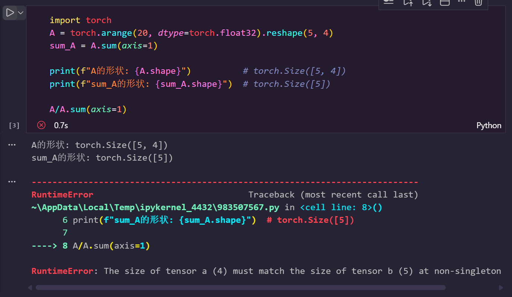

# 2026.2.8

## Brief History of Visual Object Detection 

1996年SVM(Support Vector Machine),2012年提出AlexNet，后来RCNN,fast-RCNN,faster-RCNN，再到2020年transform，2023年SAM(Segment Anything Model)

## Q & A

### 本节中定义了形状$(2,3,4)$​的张量`X`。`len(X)`的输出结果是什么？对于任意形状的张量`X`,`len(X)`是否总是对应于`X`特定轴的长度?这个轴是什么?

1. `len(X)` 的输出结果与含义

**问题：** 定义形状为 $(2, 3, 4)$ 的张量 `X`，`len(X)` 输出什么？它对应哪个轴？

**答案：**

- **输出结果**：`2`
- **对应轴**：总是对应 **轴 0 (axis 0)**，也就是最外层的维度。

### 运行`A/A.sum(axis=1)`，看看会发生什么。请分析一下原因？

假设 `A` 是一个二维张量，形状为 $(5, 4)$。

1. **求和操作**：`A.sum(axis=1)` 会沿着轴 1（列）将元素相加，从而消掉轴 1。

   - 输入形状：$(5, 4)$
   - 输出形状：$(5,)$ （注意：这里维度变成了一维向量）

2. **除法操作**：试图计算 `(5, 4)` 除以 `(5,)`。

3. **广播失败**：

   PyTorch/NumPy 的广播规则是从**最右边的维度**开始对齐的：

   - `A`:      $(5, \mathbf{4})$
   - `Sum`:    $(~, \mathbf{5})$
   - **冲突**：右侧维度的 `4` 和 `5` 不相等，且都不为 1，因此无法广播，导致报错。

**如何修正？**

需要保持维度（Keepdims），让求和后的结果变成 $(5, 1)$，这样 $(5, 4)$ 和 $(5, 1)$ 就可以成功广播了。

广播规则规定：两个维度兼容，当且仅当它们**相等**，或者**其中一个是 1**。

### 考虑一个具有形状$(2,3,4)$​的张量，在轴0、1、2上的求和输出是什么形状?

求和操作（如果不使用 `keepdims=True`）会**移除**指定的维度。

- **轴 0 (axis=0)**：消除第 1 个维度 $(2)$。
  - 输出形状：$(3, 4)$
- **轴 1 (axis=1)**：消除第 2 个维度 $(3)$。
  - 输出形状：$(2, 4)$
- **轴 2 (axis=2)**：消除第 3 个维度 $(4)$。
  - 输出形状：$(2, 3)$

**直观记忆法：** 输入形状是 $(d_0, d_1, d_2)$，如果你对 $d_i$ 求和，结果形状里就把 $d_i$ 删掉，剩下的拼起来。

### 为`linalg.norm`函数提供3个或更多轴的张量，并观察其输出。对于任意形状的张量这个函数计算得到什么?

对于任意形状的张量（无论是 3D、4D 还是更高维），如果不指定 `dim`（轴）参数，`torch.linalg.norm` 默认计算的是**弗罗贝尼乌斯范数 (Frobenius Norm)**，也就是整个张量中**所有元素的平方和的平方根**。

其输出总是一个**标量 (Scalar)**，即形状为 `torch.Size([])` 的 0 维张量。

## 梯度

我们可以连结一个多元函数对其所有变量的偏导数，以得到该函数的*梯度*（gradient）向量。
具体而言，设函数$f:\mathbb{R}^n\rightarrow\mathbb{R}$的输入是
一个$n$维向量$\mathbf{x}=[x_1,x_2,\ldots,x_n]^\top$，并且输出是一个标量。
函数$f(\mathbf{x})$相对于$\mathbf{x}$的梯度是一个包含$n$个偏导数的向量:

$$\nabla_{\mathbf{x}} f(\mathbf{x}) = \bigg[\frac{\partial f(\mathbf{x})}{\partial x_1}, \frac{\partial f(\mathbf{x})}{\partial x_2}, \ldots, \frac{\partial f(\mathbf{x})}{\partial x_n}\bigg]^\top,$$

其中$\nabla_{\mathbf{x}} f(\mathbf{x})$通常在没有歧义时被$\nabla f(\mathbf{x})$取代。

假设$\mathbf{x}$为$n$维向量，在微分多元函数时经常使用以下规则:

* 对于所有$\mathbf{A} \in \mathbb{R}^{m \times n}$，都有$\nabla_{\mathbf{x}} \mathbf{A} \mathbf{x} = \mathbf{A}^\top$
* 对于所有$\mathbf{A} \in \mathbb{R}^{n \times m}$，都有$\nabla_{\mathbf{x}} \mathbf{x}^\top \mathbf{A}  = \mathbf{A}$
* 对于所有$\mathbf{A} \in \mathbb{R}^{n \times n}$，都有$\nabla_{\mathbf{x}} \mathbf{x}^\top \mathbf{A} \mathbf{x}  = (\mathbf{A} + \mathbf{A}^\top)\mathbf{x}$
* $\nabla_{\mathbf{x}} \|\mathbf{x} \|^2 = \nabla_{\mathbf{x}} \mathbf{x}^\top \mathbf{x} = 2\mathbf{x}$

同样，对于任何矩阵$\mathbf{X}$，都有$\nabla_{\mathbf{X}} \|\mathbf{X} \|_F^2 = 2\mathbf{X}$。
正如我们之后将看到的，梯度对于设计深度学习中的优化算法有很大用处。

## 自动微分(autograd)

深度学习框架通过自动计算导数，即（automatic differentiation）来加快求导。实际中，根据设计好的模型，系统会构建一个计算图，来跟踪计算是哪些数据通过哪些操作组合起来产生输出。自动微分使系统能够随后反向传播梯度

## 机器学习那些事

### 数据

如果没有数据，那么数据科学将无用武之地。每个数据集由一个个样本组成，大多时候，它们遵循独立同分布。通常每个样本由一组特征（features）的属性组成。机器学习模型会根据这些属性进行预测。在监督学习问题中，要预测的是一个属性，它被称为标签（label）或目标（target）。

当每个样本的特征类别数量都是一样的时候，其特征向量是固定长度的，这个长度被称为数据的维数。它可以用来量化学习大量样本。

然而不是所有的数据都可以用“固定长度”的向量表示。

以图像数据为例，如果它们全部来自标准显微镜设备，那么“固定长度”是可取的；

但是如果图像数据来自互联网，它们很难具有相同的分辨率或形状。

这时，将图像裁剪成标准尺寸是一种方法，但这种办法很局限，有丢失信息的风险。

此外，文本数据更不符合“固定长度”的要求。

比如，对于亚马逊等电子商务网站上的客户评论，有些文本数据很简短（比如“好极了”），有些则长篇大论。

与传统机器学习方法相比，深度学习的一个主要优势是可以处理不同长度的数据。

光有海量的数据是不够的，我们还需要正确的数据。如果数据中充满了错误，就成了Garbage in Garbage out。

### 模型

大多数机器学习会涉及到数据的转换。比如一个“摄取照片并预测笑脸”的系统。虽然简单的模型能够解决如上简单的问题，但深度学习与经典方法的区别主要在于：前者关注的功能强大的模型，这些模型由错综复杂的神经网络交织在一起，包含层层数据转换，因此被称为深度学习（deep learning）。

### 目标函数

在机器学习中，我们需要定义模型的优劣程度的度量，这个度量在大多数情况下是可优化的，这被称之为目标函数（objective function）。我们通常定义一个目标函数，并希望优化它到最低点。因为越低越好，所以这些函数有时候被称为损失函数（loss function，或cost function）。但这只是一个惯例，我们也可以取一个新的函数，优化到它的最高点，这两个函数本质上是相同的，只是翻转一下符号。

当任务在试图预测数值时，最常见的损失函数是平方误差（squared error），即预测值与实际值之间差的平方。当试图解决分类问题时，最常见的目标函数是最小化错误率，即预测与实际情况不符合的样本比例。

通常损失函数是根据模型参数定义的，并取决于数据集。在一个数据集上，我们可以通过最小化总损失来学习模型参数的最佳值。该数据集由一些为训练而收集的样本组成，称为训练数据集，或者称训练集（training set）。然而，在训练集上表现良好的模型，并不一定在“新数据集”上有同样的性能，这里的“新数据集”通常称为测试集（test set）。

### 优化算法

当我们获得了一些数据源及其表示、一个模型和一个合适的损失函数，接下来就需要一种算法，它能够搜索出最佳参数，以最小化损失函数。在深度学习中，大多流行的优化算法通常基于一种基本方法--梯度下降法（gradient descent）。简而言之，梯度下降法在每个步骤中都会检查参数，看看如果仅对该参数进行少量变动，训练集损失会朝着哪个方向移动。然后，它在可以减少损失的方向上优化参数。

### 监督学习（supervised learning）

擅长在“给定输入特征”的情况下预测标签。每个“特征-标签”对都称为一个样本。有时，即使标签是未知的，样本也可以指代输入特征。我们的目标是生成一个模型，能够将任何输入特征映射到标签（即预测）

监督学习的学习过程一般可以分为三大步骤：

1. 从已知大量数据样本中随机选取一个子集，为每个样本获取真实标签。有时，这些样本已有标签（例如，患者是否在下一年内康复？）；有时，这些样本可能需要被人工标记（例如，图像分类）。这些输入和相应的标签一起构成了训练数据集；
2. 选择有监督的学习算法，它将训练数据集作为输入，并输出一个“已完成学习的模型”；
3. 将之前没有见过的样本特征放到这个“已完成学习的模型”中，使用模型的输出作为相应标签的预测。

### 回归（regression）

